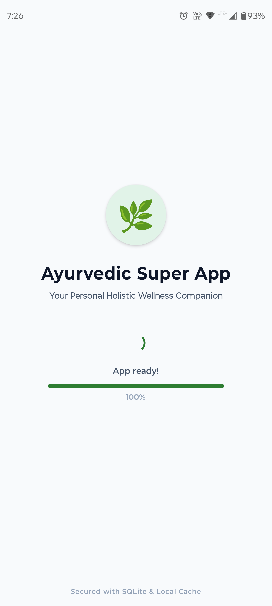
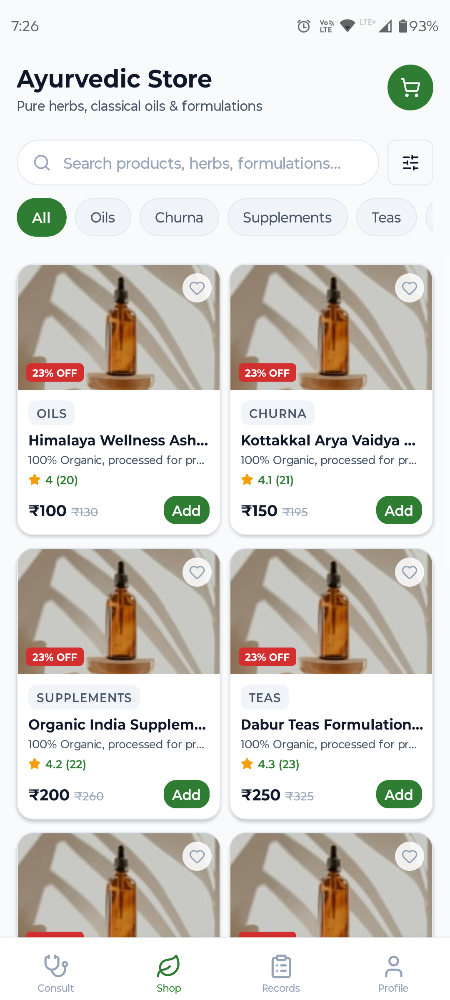
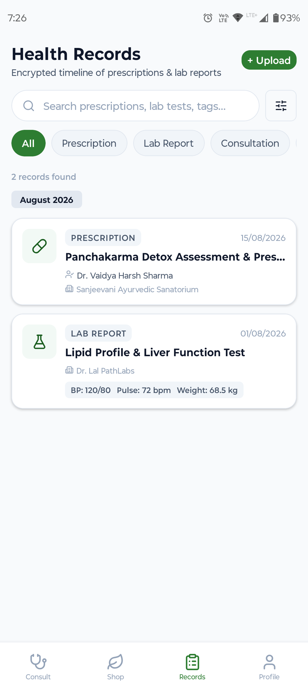
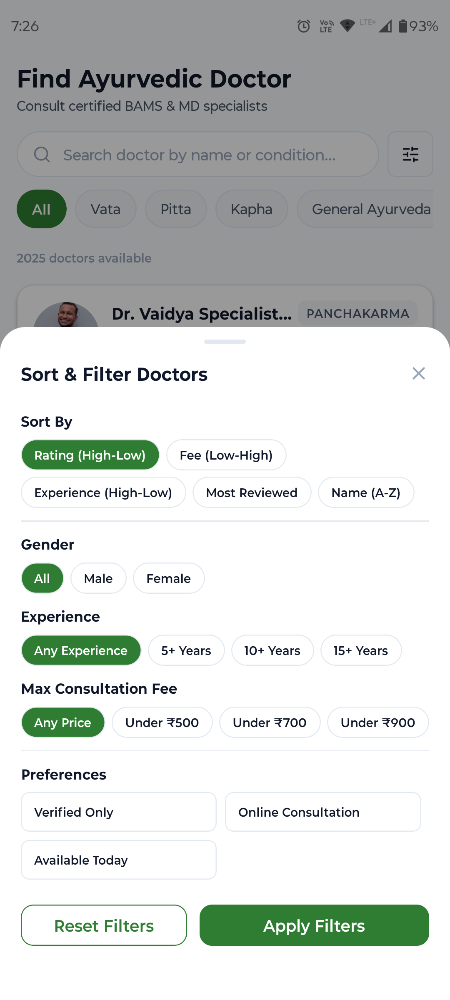
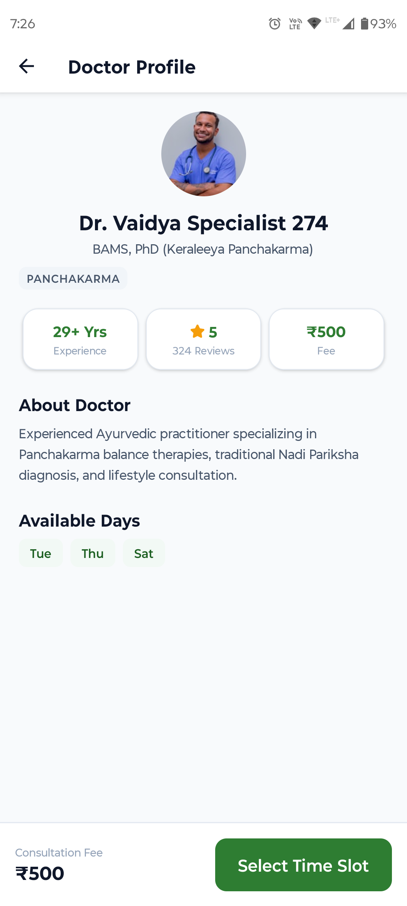
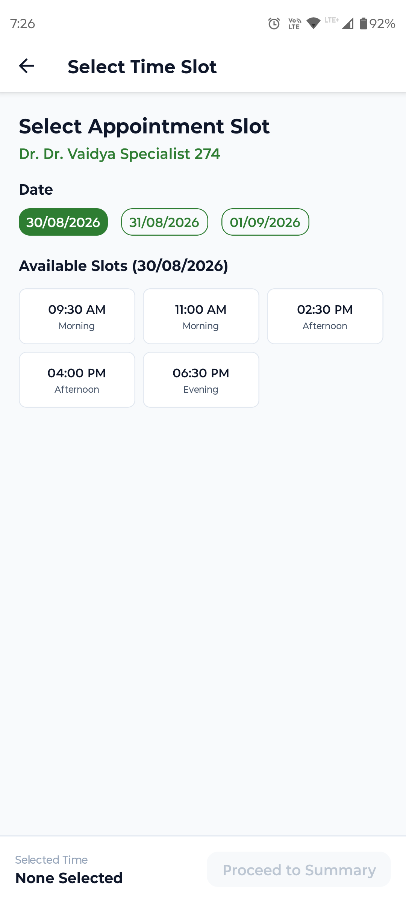
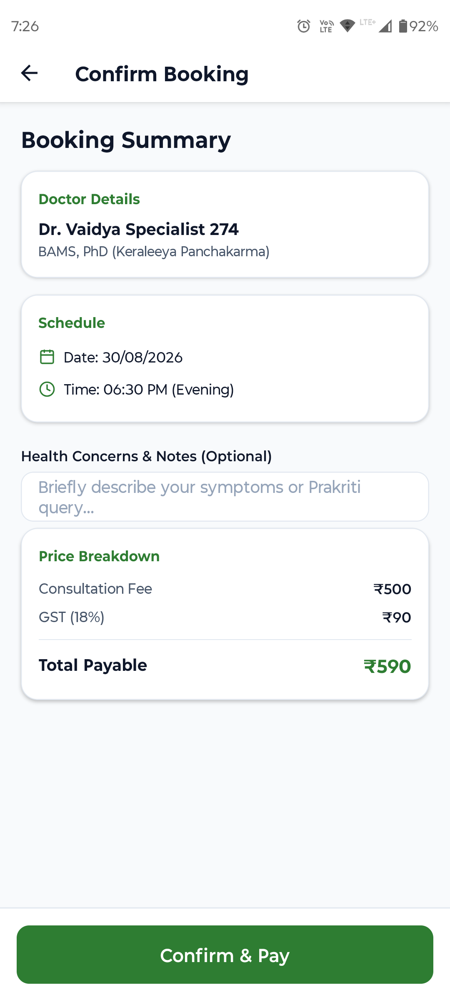
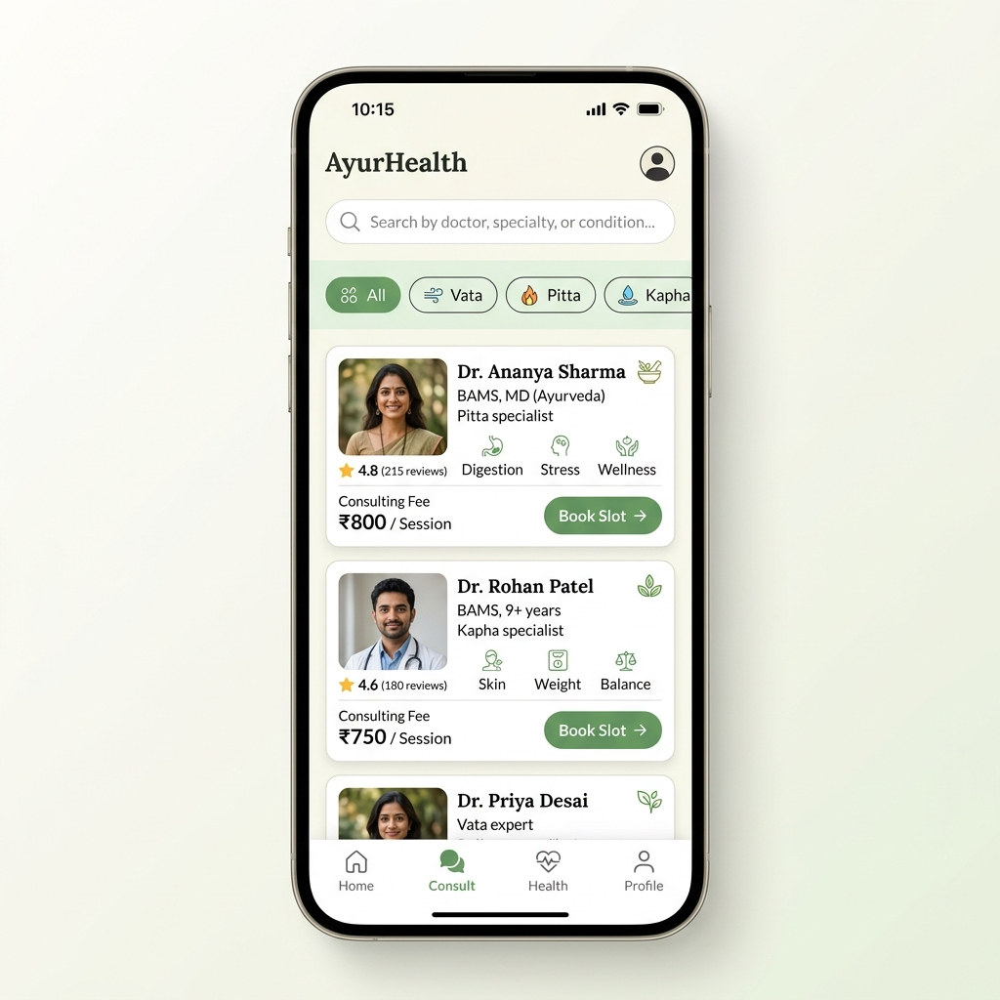
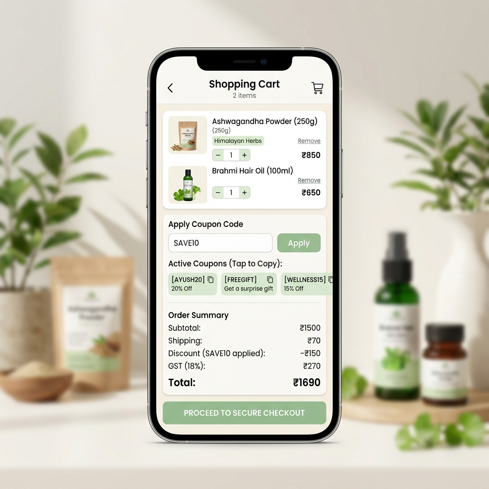
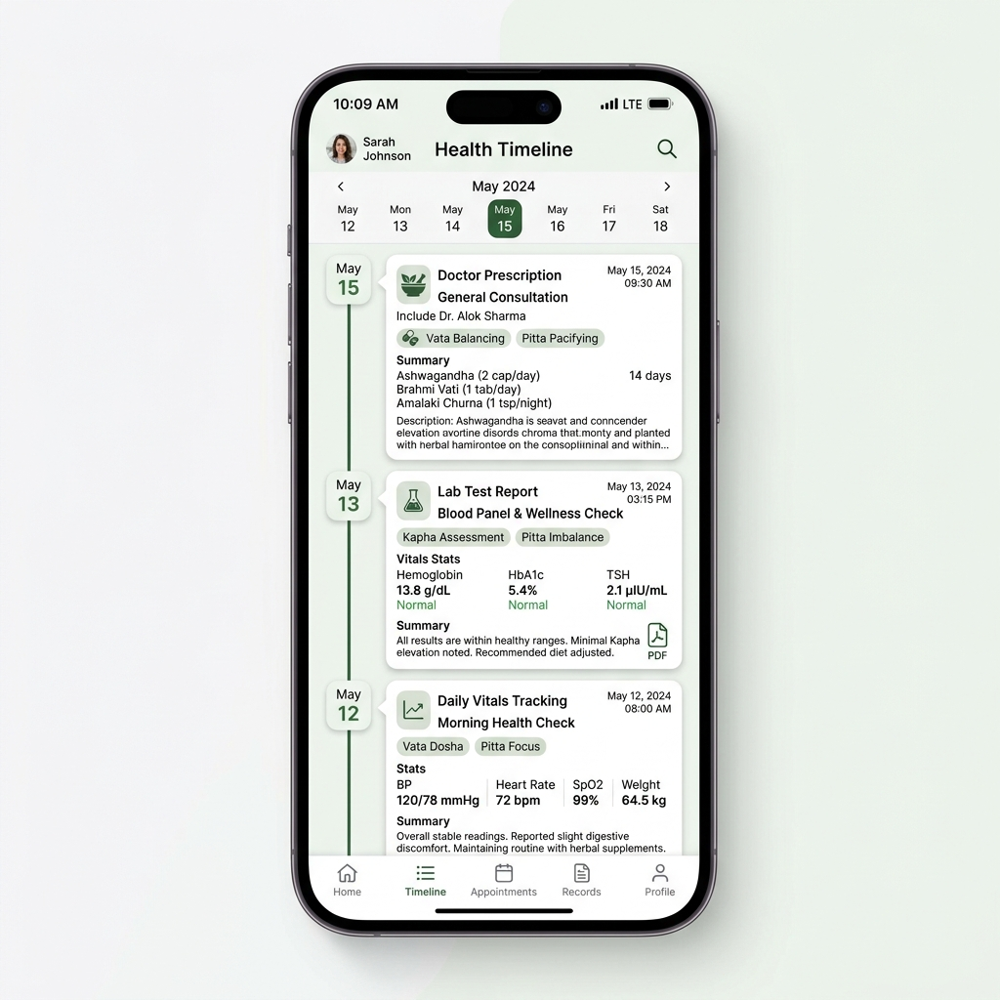

# Ayurvedic Super App 🌿

A production-grade, offline-first mobile application built with **React Native**, **TypeScript**, **Redux Toolkit**, and **Clean Architecture**. The portal combines three completely independent health & wellness business modules into a unified, high-performance portal.

---

## 📸 Screenshots & Visual Representation

Here is a preview of the main application modules showing the refined layout, virtualized lists, custom chips, and unified theme styles:

### 📱 Real App Screenshots

#### 🩺 Consult & Doctor Booking
| 1. Doctor List | 2. Filter & Sort | 3. Slot Booking |
| :---: | :---: | :---: |
|  |  |  |

#### 🛒 E-Commerce & Checkout
| 4. Product Catalog | 5. Cart Management | 6. Checkout Summary |
| :---: | :---: | :---: |
|  |  |  |

#### 📋 Health Records & Profiles
| 7. Records Timeline | 8. User Profile | 9. Offline Queue |
| :---: | :---: | :---: |
|  |  |  |

### 🎨 Conceptual Mockups

| 🩺 Doctor Consultations Mockup | 🛒 Checkout Cart Mockup | 📋 Health Records Mockup |
| :---: | :---: | :---: |
|  |  |  |

---

## 🏛️ Application Architecture & Folder Structure

The project strictly follows **Clean Architecture** with a **Feature-Based** modular organization pattern. This ensures that the e-commerce store, consultations, and electronic health records are decoupled, fully testable, and highly scalable:

```
src/
├── app/                  # Bootstrap configuration, theme tokens, store, navigation
│   ├── constants/        # Route names, storage keys, environment limits
│   ├── navigation/       # Root stack and bottom tab navigators
│   ├── store/            # Redux Toolkit store setup
│   └── theme/            # Centralized theme palette, spacing, and typography
│
├── core/                 # Shared enterprise infrastructure & framework adapters
│   ├── api/              # Global Axios HTTP client & response interceptors
│   ├── database/         # SQLite DB client, migrations, and caching policies
│   ├── errors/           # AppError domain class & React ErrorBoundary
│   ├── logger/           # Structured logging service
│   ├── network/          # NetInfo network status monitor hook
│   ├── offline/          # Persistent mutation queue & Sync Manager
│   └── storage/          # Rapid storage engine adapter (MMKV fallback)
│
├── features/             # Independent Feature Modules
│   ├── consultation/     # BAMS doctor listing, slots repository, slices & components
│   ├── shop/             # Product catalog, cart calculations, copyable coupons & slices
│   ├── healthRecords/    # Encrypted health documents timeline, vital charts & slices
│   └── profile/          # User profiles, preferences, and offline queue inspect
│
└── shared/               # Atomic Design System
    └── components/ui/    # Reusable Buttons, Cards, Skeletons, empty states, and custom Toasts
```

---

## 📶 Offline-First Repository Pattern

UI components are completely decoupled from endpoints and database implementations. Data flows through a unidirectional lifecycle:

```
UI View Component ➔ Selector ➔ Redux Async Thunk ➔ Local Repository ➔ Cache Check (Expiration)
                                                                 │
                                             ┌───────────────────┴───────────────────┐
                                             ▼ (Fresh Cache)                         ▼ (Expired Cache)
                                      Resolve SQLite data                    Query SQLite data
                                                                             Query API Client in Background
                                                                             Reconcile & Compare Diff
                                                                             Commit Writes to SQLite
                                                                             Dispatch Redux Store Update
```

- **Immediate Resolving**: The repository queries the local SQLite database first to load the UI in less than **10 milliseconds**.
- **Background Synchronization**: If the cached data's lifespan has expired (evaluated using the `CachePolicy`), the repository spins off a background API fetch, resolves differences (inserts new items, updates modified fields, soft-deletes missing records), commits changes to SQLite, and pushes an updated state to Redux.
- **Persistent Mutation Queue**: Offline modifications (e.g., booking slots or adding records) are stored in the `OfflineQueue` using MMKV storage. The queue automatically attempts to sync sequentially once network connection is restored.

---

## ⚡ Key Optimizations

1. **Transactional Seeding**: Seeded datasets containing **2,000 doctors** and **2,000 products** are compiled in single transaction blocks (`sqlite.transaction`). This reduces startup database commit latency from **15 seconds to under 400 milliseconds**.
2. **Composite Sorting**: Sorting filters (like Fee sorting) implement secondary tie-breakers (e.g. sorting by rating if fees are equal) to prevent arbitrary ordering in duplicate datasets.
3. **Smooth Scroll-to-Top**: FlatLists automatically snap back to index `0` whenever search queries or filters reset, ensuring clean pagination cycles.
4. **Interactive Checkout Coupons Chip**: Tapping coupons in the Cart page copies them to the clipboard, applies the discount rate instantly, and renders an active indicator with a "Remove" control to revert cart totals.

---

## 🧪 Running Tests & Scripts

Verify the test suite passes cleanly by running:
```bash
npm test
```

### Development Scripts:
- Start Metro bundler: `npm start`
- Run on Android: `npm run android`
- Run on iOS: `npm run ios`

---

## 🛠️ System Requirements
- **Node.js**: >= 22.11.0
- **React Native**: 0.87.1
- **React**: 19.2.3
- **TypeScript**: 5.0+
